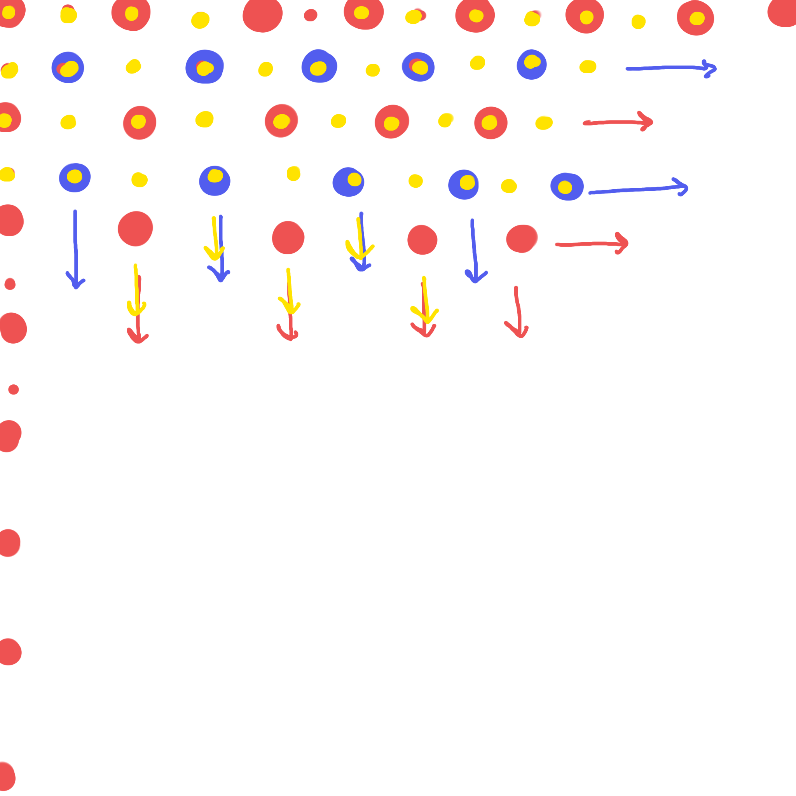

# HOMEWORK 03 PART A

## SUMMARY
This code aims to create a Yayoi Kusama style image with large and small circles that repeat.

----

My initial plan was to create a repeating pattern of the large polka dots in one set of netsted for loops, and to then repeat this for the small dots in a seperate nest of loops. With a canvas of 400x400, I mentally split it into segments of 50 units to visualize. The hardest part thus far was figuring out my issue with the smaller dots, as they would not appear.

I realized that my for loops should not have been nested within each other, and that it would be easier to have specific for loops for the dots that started at the origin in the x and y, and the dots that started away from it. Upon doing this, I was able to achieve the image. 

Image on repo:  
